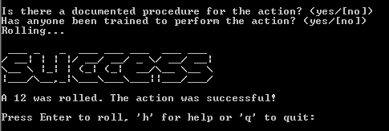

This is a web and python implementation of Black Hills Infosec's 'Dungeons & Dragons' table top game.

You can read more about the game, and thought process behind it at: https://www.blackhillsinfosec.com/dungeons-dragons-meet-cubicles-compromises/

This was built to have a highly portable impelmentation of the game (Shipping dice around the world just isn't as practical as you'd think). 

The python script can be converted to an exe with pyinstaller or one of the other python to exe converters.

The website is a completely client side implementation of the game that utilizes the jquery terminal emulator (http://terminal.jcubic.pl/)

Feel free to share, and modify this implementation to meet your needs!

Screentshots!

